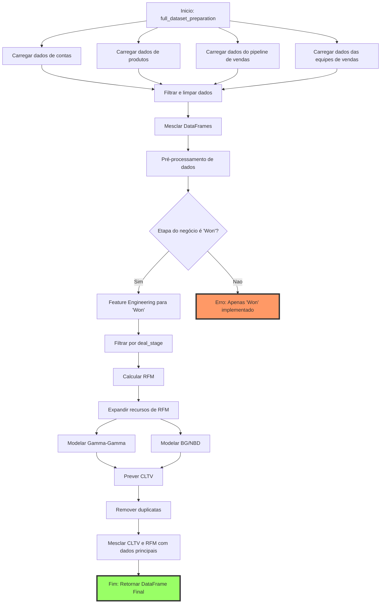

# AI Agent Analysis of a CRM System

Refs:
- https://www.dataside.com.br/dataside-community/big-data/afinal-o-que-e-a-arquitetura-medalhao
- https://www.pymc-marketing.io/en/stable/notebooks/clv/bg_nbd.html
-

Fluxo de ETL feito para o pre-processamento, FEature Engineering e previsão de modelos no dataset completo do CRM:

