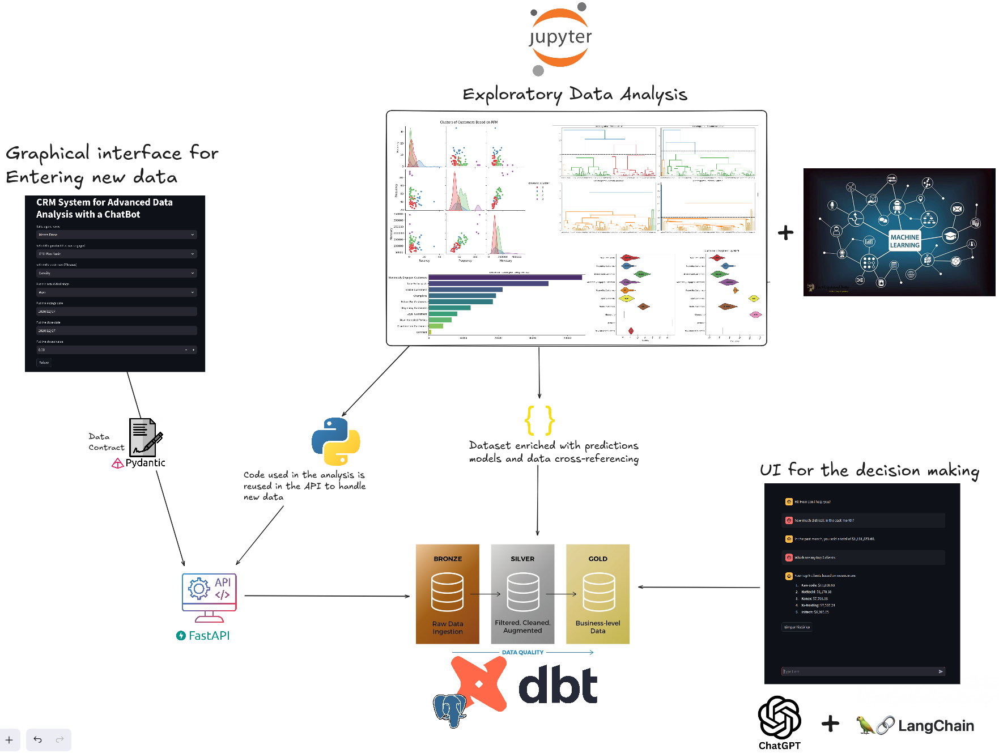
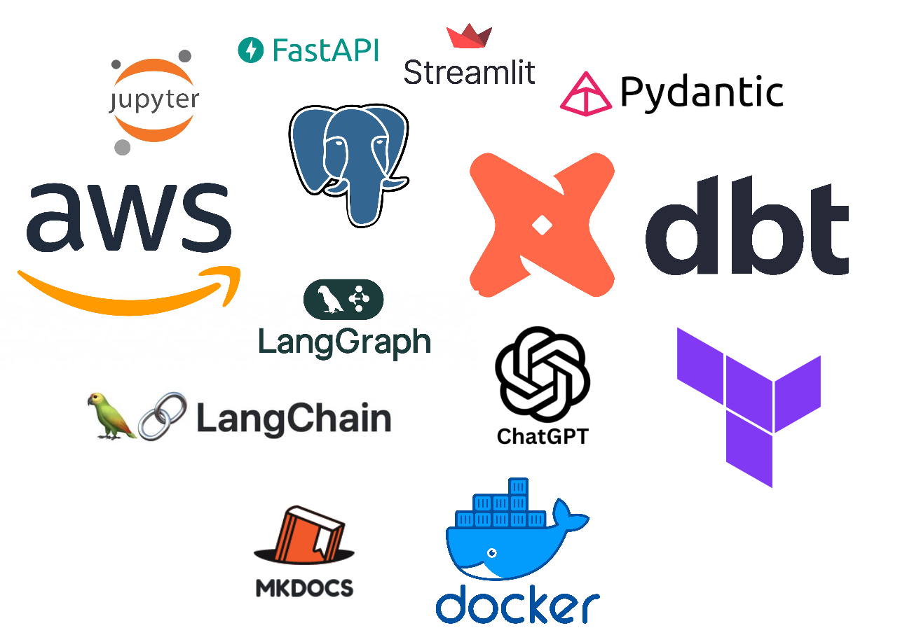
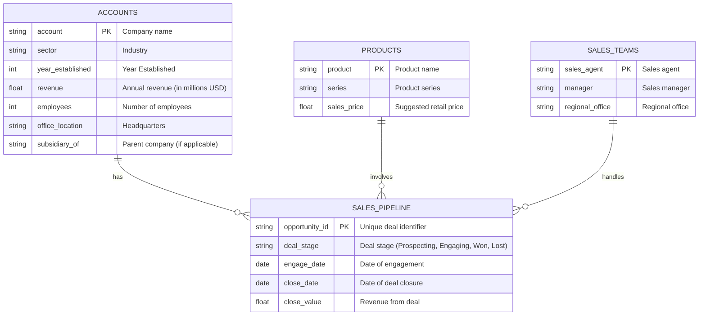
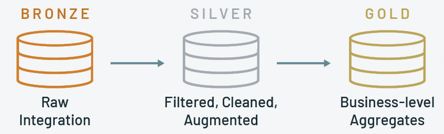
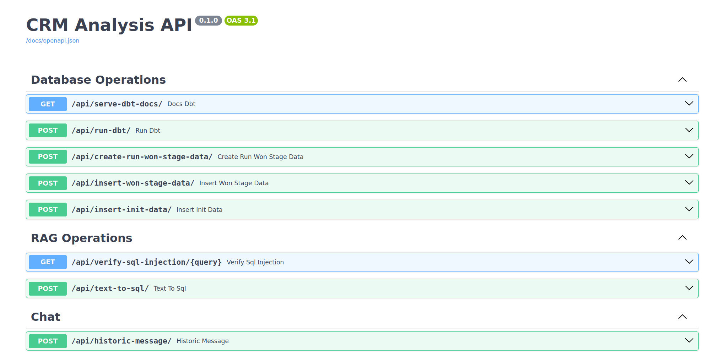
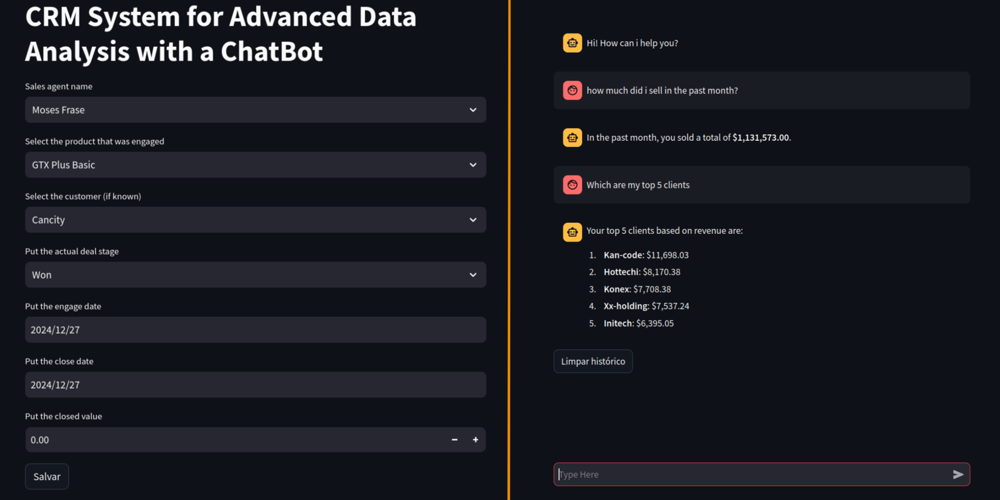
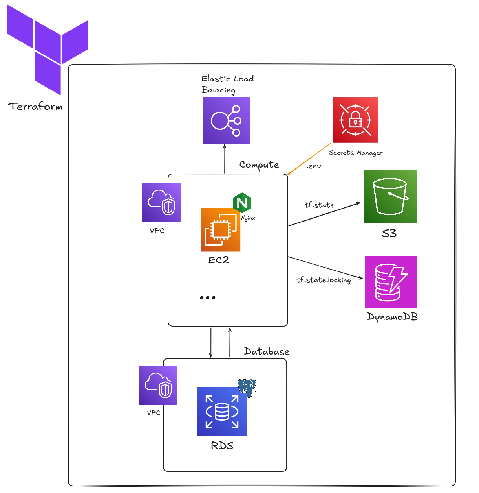

# AI Agent Analysis of a CRM System

## Table of Contents

- [Introduction](#introduction)
    - [Project Workflow](#project-workflow)
- [Project Overview](#project-overview)
    - [Project Directory Structure](#project-directory-structure)
    - [Main Technologies Used](#main-technologies-used)
    - [Dataset Overview](#dataset-overview)
        - [Base Key Insights from the Dataset](#base-key-insights-from-the-dataset)
        - [Data Model](#data-model)
- [System Architecture, Data Flow, Modeling & Query System](#system-architecture-data-flow-modeling--query-system)
    - [System Architecture](#system-architecture)
    - [Data Flow & Processing Pipeline](#data-flow--processing-pipeline)
    - [Modeling & Predictions](#modeling--predictions)
    - [Intelligent Query System (Text-to-SQL Agent)](#intelligent-query-system-text-to-sql-agent)
- [Deployment & Execution](#deployment--execution)
    - [Development Environment](#development-environment)
    - [Production Environment](#production-environment)
    - [Deployment Process](#deployment-process)
        - [Steps to Set Up Infrastructure:](#steps-to-set-up-infrastructure)
        - [Deployment Steps:](#deployment-steps)
- [Future Improvements](#future-improvements)
- [References](#references)

## Introduction

In today's competitive hardware market, understanding customer behavior and optimizing sales strategies are essential for sustaining growth and driving profitability. This project was designed to empower a hardware company by leveraging advanced data analysis and machine learning techniques to extract actionable insights from their CRM dataset. The initiative began with an extensive exploratory data analysis (EDA) conducted in a Jupyter Notebook, where key variables such as customer profiles, sales team performance, product dynamics, deal stages, and close values were meticulously examined. This initial exploration provided a comprehensive view of the data landscape, highlighting both opportunities and areas for improvement.

Building on the insights from the EDA, a series of feature engineering steps were implemented to enrich the dataset with new variables that capture nuanced customer behavior. The project then employed multiple clustering techniques, including K-Means, Agglomerative Clustering, HDBSCAN with UMAP, and notably, an RFM (Recency, Frequency, Monetary) segmentation approach, which ultimately delivered the most robust performance metrics (Davies-Bouldin, Silhouette, and Calinski-Harabasz scores). This segmentation strategy has proven crucial for identifying distinct customer groups, thereby enabling more targeted marketing and sales initiatives.

Further advancing the project’s analytical capabilities, statistical predictive models using the Beta Geo Fitter and Gamma Gamma Fitter were developed to estimate Customer Lifetime Value (CLTV). These models not only provide a forward-looking perspective on customer profitability but also serve as a critical input for strategic decision-making.

To operationalize these insights, the project's codebase was modularized into a FastAPI-driven backend and a Streamlit-based frontend. The FastAPI handles data cleaning, preprocessing, feature engineering, and model predictions automating the entire pipeline. Processed data is then stored in a PostgreSQL database and further transformed using DBT into structured layers (bronze for raw data, silver for centralized staging, and gold for business-ready views). This layered approach ensures that decision-makers access the most reliable and insightful data for their queries.

Additionally, the system features an intelligent chatbot powered by LangChain and LangGraph, which converts natural language questions into safe and efficient SQL queries. This interactive tool enhances the accessibility of complex data insights, allowing business users to extract precise information without requiring in-depth technical knowledge. Moreover, the project integrates a robust Data Contract using Pydantic to validate new data inputs before they are added to the database, ensuring consistency and reliability throughout the data ingestion process.

Deployed using Docker and orchestrated via Terraform on AWS (leveraging EC2, RDS, S3, DynamoDB, and load balancers), the project ensures a scalable and robust infrastructure. Overall, this integrated solution not only streamlines data processing and predictive analytics but also empowers the hardware company with the tools needed to make informed, data-driven decisions that can significantly enhance customer engagement and drive business success.

### Project Workflow

Here is a diagram showing the project's execution flow:



## Project Overview

This project focuses on analyzing customer relationship management (CRM) data from a hardware sales company to derive meaningful insights and enhance decision-making. The workflow begins with exploratory data analysis (EDA) in a Jupyter Notebook, followed by feature engineering, customer segmentation, predictive modeling, and the deployment of an interactive application.

### Project Directory Structure

To show how the directories and files of these features are organized, take a look at the project tree:

```bash
.
├── api
│   ├── chat
│   │   ├── __init__.py
│   │   ├── messages.py
│   │   └── services.py
│   ├── core
│   │   ├── configs.py
│   │   ├── database.py
│   │   ├── deps.py
│   │   ├── __init__.py
│   ├── main.py
│   ├── models
│   │   ├── accounts_model.py
│   │   ├── historic_messages_model.py
│   │   ├── __init__.py
│   │   ├── products_model.py
│   │   ├── sales_pipeline_model.py
│   │   └── sales_teams_model.py
│   ├── schemas
│   │   ├── historic_messages_schema.py
│   │   ├── __init__.py
│   │   ├── sales_pipeline_schema.py
│   │   └── sql_agentic_rag_schema.py
│   ├── src
│   │   ├── database_operations.py
│   │   ├── historic_messages.py
│   │   ├── __init__.py
│   │   └── rag_operations.py
│   └── utils
│       ├── export_models.py
│       ├── full_dataset_preparation.py
│       ├── __init__.py
│       └── tables_metadata_prompt.py
├── app
│   ├── __init__.py
│   └── ui
│       ├── assets
│       ├── home.py
│       ├── __init__.py
│       ├── pages
│       │   ├── add_new_data.py
│       │   ├── __init__.py
│       │   └── query_database.py
│       └── utils
│           ├── api_calls.py
│           ├── __init__.py
├── data
│   ├── accounts.csv
│   ├── archive.zip
│   ├── products.csv
│   ├── sales_pipeline.csv
│   ├── sales_teams.csv
│   └── won_stage_enriched_data.json
├── datawarehouse
│   ├── analyses
│   ├── dbt_project.yml
│   ├── macros
│   │   └── call_api.sql
│   ├── models
│   │   ├── bronze
│   │   │   ├── raw-customers_rfm_features.sql
│   │   │   ├── raw-general_enriched_dataset.sql
│   │   │   └── raw-model_predictions_summary.sql
│   │   ├── gold
│   │   │   ├── customer_profitability_analysis.sql
│   │   │   ├── customer_retention_analysis.sql
│   │   │   ├── customer_segmentation_analysis.sql
│   │   │   ├── products_sales_analysis.sql
│   │   │   ├── regional_sales_performance.sql
│   │   │   ├── sales_agent_performance.sql
│   │   │   ├── sales_performance_analysis.sql
│   │   │   └── sector_wise_revenue_analysis.sql
│   │   ├── silver
│   │   │   └── stg-won_deal_stage.sql
│   │   └── sources.yml
│   ├── profiles.yml
│   ├── README.md
│   ├── seeds
│   ├── snapshots
│   ├── target
│   │   ├── catalog.json
│   │   ├── compiled
│   │   ├── graph.gpickle
│   │   ├── graph_summary.json
│   │   ├── index.html
│   │   ├── manifest.json
│   │   ├── partial_parse.msgpack
│   │   ├── run
│   │   ├── run_results.json
│   │   └── semantic_manifest.json
│   └── tests
├── docker-compose.dev.yaml
├── docker-compose.prod.yaml
├── Dockerfile
├── Dockerfile.mkdocs
├── docs
│   ├── api
│   │   ├── chat
│   │   │   ├── messages.md
│   │   │   └── services.md
│   │   ├── core
│   │   │   └── deps.md
│   │   ├── main.md
│   │   ├── models
│   │   │   ├── accounts_model.md
│   │   │   ├── historic_messages_model.md
│   │   │   ├── products_model.md
│   │   │   ├── sales_pipeline_model.md
│   │   │   └── sales_teams_model.md
│   │   ├── schemas
│   │   │   ├── historic_messages_schema.md
│   │   │   ├── sales_pipeline_schema.md
│   │   │   └── sql_agentic_rag_schema.md
│   │   ├── src
│   │   │   ├── database_operations.md
│   │   │   ├── historic_messages.md
│   │   │   └── rag_operations.md
│   │   └── utils
│   │       ├── export_models.md
│   │       ├── full_dataset_preparation.md
│   │       └── tables_metadata_prompt.md
│   ├── app
│   │   └── ui
│   │       ├── pages
│   │       │   └── query_database.md
│   │       └── utils
│   │           └── api_calls.md
│   ├── datawarehouse
│   ├── index.md
│   └── shared
│       └── contracts
│           └── user_input_contract.md
├── execute.sh
├── main.tf
├── mkdocs.yml
├── models
│   ├── beta_geo_fitter.pkl
│   └── gamma_gamma_fitter.pkl
├── notebooks
│   ├── CRM_analysis.ipynb
│   └── RAG_SqlDatabase.ipynb
├── README.md
├── references
│   └── data_dictionary.csv
├── reports
│   └── figures
│       └── project_workflow.png
├── requirements.txt
├── shared
│   ├── contracts
│   │   ├── __init__.py
│   ├── __init__.py
├── start_terraform.sh
├── terraform.tfstate
├── terraform.tfvars
└── variables.tf
```

### Main Technologies Used

Below is a overview of the project context with each technology used in the project:



- **Jupyter Notebook**: Used for initial exploratory data analysis and rapid prototyping of models.
- **FastAPI**: Powers the backend API, managing data preprocessing, feature engineering, and model predictions.
- **Streamlit**: Provides the interactive dashboard for data ingestion and user-friendly visualization.
- **Pydantic**: Enforces data contracts to validate new data inputs before processing.
- **PostgreSQL**: Acts as the central relational database for storing both raw and processed data.
- **DBT**: Transforms raw data into structured, layered formats (bronze, silver, gold) for analysis.
- **Docker**: Containerizes the entire application to ensure consistency across environments.
- **Terraform**: Automates cloud infrastructure provisioning, enabling scalable deployments.
- **AWS**: Hosts the application infrastructure, including compute (EC2 and ELB), storage (S3 and DynamoDB), and database resources (RDS).
- **LangChain**: Facilitates the conversion of natural language queries into structured SQL commands.
- **LangGraph**: Works alongside LangChain to enhance the interactive querying capabilities using AI agents.
- **ChatGPT**: Enhances the conversational interface, providing dynamic, contextual responses.
- **MkDocs**: Generates and maintains comprehensive documentation for the project.

### Dataset Overview

All the data analysis was made on this public dataset in Kaggle: https://www.kaggle.com/datasets/innocentmfa/crm-sales-opportunities/

| Table          | Field             |                   Description                                               |
|----------------|-------------------|-----------------------------------------------------------------------------|
| accounts       | account           | Company name                                                                |
| accounts       | sector            | Industry                                                                    |
| accounts       | year_established  | Year Established                                                            |
| accounts       | revenue           | Annual revenue (in millions of USD)                                         |
| accounts       | employees         | Number of employees                                                         |
| accounts       | office_location   | Headquarters                                                                |
| accounts       | subsidiary_of     | Parent company                                                              |
| products       | product           | Product name                                                                |
| products       | series            | Product series                                                              |
| products       | sales_price       | Suggested retail price                                                      |
| sales_teams    | sales_agent       | Sales agent                                                                 |
| sales_teams    | manager           | Respective sales manager                                                    |
| sales_teams    | regional_office   | Regional office                                                             |
| sales_pipeline | opportunity_id    | Unique identifier                                                           |
| sales_pipeline | sales_agent       | Sales agent                                                                 |
| sales_pipeline | product           | Product name                                                                |
| sales_pipeline | account           | Company name                                                                |
| sales_pipeline | deal_stage        | Sales pipeline stage (Prospecting > Engaging > Won / Lost)                  |
| sales_pipeline | engage_date       | Date in which the "Engaging" deal stage was initiated                       |
| sales_pipeline | close_date        | Date in which the deal was "Won" or "Lost"                                  |
| sales_pipeline | close_value       | Revenue from the deal                                                       |
|

Each table in the dataset contains structured information essential for analyzing customer behavior, sales performance, and product demand. Below is a detailed description of each table and its respective fields, including their data types and business relevance.

1. **Accounts Table (Customer Information)**

    This table holds information about companies that interact with the hardware business.

    - `account` **(Categorical, String)**: The name of the customer company.
    - `sector` **(Categorical, String)**: The industry in which the company operates (e.g., software, healthcare, finance).
    - `year_established` **(Numerical, Integer)**: The year the company was founded, useful for assessing company maturity.
    - `revenue` **(Numerical, Float)**: The annual revenue of the company (in millions of USD), providing insights into financial health.
    - `employees` **(Numerical, Integer)**: The number of employees, indicating company size.
    - `office_location` **(Categorical, String)**: The headquarters location, relevant for regional analysis.
    - `subsidiary_of` **(Categorical, String, Nullable)**: The parent company, if applicable, showing company hierarchy.

2. **Products Table (Product Catalog)**

    Contains information about the different hardware products offered.

    - `product` **(Categorical, String)**: The product name (e.g., "GTC Basic", "GTX Pro").
    - `series` **(Categorical, String)**: The product family or series (e.g., "Enterprise Servers", "Gaming Laptops").
    - `sales_price` **(Numerical, Float)**: The suggested retail price, important for pricing analysis.

3. **Sales Teams Table (Sales Agents and Management)**

    Details about the sales force responsible for handling deals.

    - `sales_agent` **(Categorical, String)**: The name of the salesperson handling the deal.
    - `manager` **(Categorical, String)**: The name of the sales manager overseeing the agent.
    - `regional_office` **(Categorical, String)**: The office location managing sales in a specific area.

4. **Sales Pipeline Table (Deal Tracking)**

    This table is the central fact table, tracking sales opportunities and their progression through the pipeline.

    `opportunity_id` **(Categorical, String, Unique)**: A unique identifier for each sales opportunity.
    `sales_agent` **(Categorical, String, Foreign Key → Sales Teams)**: The sales agent managing the opportunity.
    `product` **(Categorical, String, Foreign Key → Products)**: The product involved in the deal.
    `account` **(Categorical, String, Foreign Key → Accounts)**: The customer involved in the deal.
    `deal_stage` **(Categorical, String)**: The current status of the opportunity, with stages such as:
        `prospecting` – Initial contact made.
        `engaging` – The company has shown interest.
        `won` – The deal was successfully closed.
        `lost` – The deal did not proceed.
    `engage_date` **(Temporal, Date)**: The date the customer entered the "Engaging" stage.
    `close_date` **(Temporal, Date, Nullable)**: The date the deal was marked as "Won" or "Lost".
    `close_value` **(Numerical, Float, Nullable)**: The final deal amount, providing revenue impact per deal.

#### Base Key Insights from the Dataset

- **Customer Segmentation**: Revenue, sector, and deal history allow segmentation of customers.
- **Sales Performance Analysis**: Tracking sales agents and deal progression enables evaluation of team efficiency.
- **Product Demand Forecasting**: Analyzing sales trends by product and series helps optimize inventory and marketing strategies.
- **Predictive Analytics**: Features like deal stage, engage date, and close value support machine learning models for revenue forecasting.

Check out the Jupyter notebook `notebooks/CRM_analysis` in which I delved into the analysis the EDA and statiscal modeling for this dataset. 


#### Data Model

Below is an outline of the conceptual data model for the dataset. This sketch defines the main entities, their key attributes, and the relationships between them, providing a high-level view of how data is organized and interconnected.



## System Architecture, Data Flow, Modeling & Query System

This integrated solution is built upon a modular architecture that streamlines data ingestion, transformation, predictive analytics, and interactive query processing. It leverages modern tools and best practices to create a scalable and robust system that meets the complex requirements of a hardware sales company.

### System Architecture

1. **Data Pipeline & Storage**
    - **Preprocessing and Feature Engineering**:
    The system initiates with the execution of a comprehensive data pipeline triggered via Docker Compose. When the `docker-compose.dev.yaml` (for local development) or `docker-compose.prod.yaml` (for production) is launched, the FastAPI backend executes a series of operations:

        - **Data Cleaning & Preprocessing**: The raw CRM dataset, initially analyzed in a Jupyter Notebook, undergoes rigorous cleaning.
        - **Feature Engineering**: New variables are engineered to capture deeper customer insights, such as additional segmentation metrics, derived from existing features.
        - **Predictive Modeling**: Advanced models (Beta Geo Fitter and Gamma Gamma Fitter) are applied to estimate Customer Lifetime Value (CLTV) and generate enriched data outputs.

    - **Data Storage Layers**:
    Processed data is initially written into a PostgreSQL database as source tables (each with a `_source` suffix). A subsequent `dbt run` transforms these tables into a layered architecture:

        - **Bronze Layer (Raw)**: The raw, preprocessed data is stored in tables with a `raw` extension.
        - **Silver Layer (Staging)**: All the raw tables are centralized into one consolidated table with an `stg` extension, preparing the data for further business-specific transformations.
        - **Gold Layer (Business-Ready Views)**: Tailored views are created on top of the Silver layer, focusing on key business metrics and ready for high-confidence querying.

        

    - **Data Contract Validation**:
    To ensure data quality and consistency, new data inputs submitted via the Streamlit UI are validated using a robust data contract implemented in Pydantic. This step verifies the integrity of incoming data before it is integrated into the pipeline, reducing errors and maintaining a reliable dataset. The Data Contract validator code are located in `shared/contracts/user_input_contract.py` file.

2. **API & Frontend Interface**
    - **FastAPI Backend**:
    The entire pre-processing, feature engineering, and modeling code from the exploratory notebook has been modularized into a FastAPI backend. This API is responsible for:

        - Triggering the end-to-end data processing pipeline.
        - Exposing endpoints for data ingestion, model predictions, and orchestrating the dbt transformations.
        - Integrating security measures, such as validating data contracts and preventing SQL injection.
        - Endpoints for Retrieval Augmented Generation (RAG) on our golden layer views

        

    - **Streamlit Dashboard**:
    The user interface, developed using Streamlit, features two primary tabs:

        - **Data Ingestion Tab**:
        Allows company collaborators to submit new data entries (e.g., client details, product information, close value, close date, and deal stage). Each new entry is validated against the pre-defined Pydantic data contract.
        - **Chatbot and Analytics Tab**:
        Provides decision-makers with an interactive chatbot powered by LangChain and LangGraph. This tool accepts natural language queries, converts them into SQL queries, and retrieves business insights from the transformed data layers (preferably using the golden layer for more enriched responses). It offers a seamless and intuitive experience for non-technical users to access complex data analyses.

        

3. **Infrastructure as Code (Terraform & AWS)**
    - **Terraform Deployment**:
    The production environment is defined as code using Terraform. The configuration includes:

        - **Backend Storage**: S3 and DynamoDB are utilized to manage Terraform state in a shared backend.
        - **Compute Resources**: An EC2 instance is provisioned to run the entire containerized application.
        - **Networking**: An Nginx load balancer is configured to expose the services securely on the web along with a Elastic Load Balancer.
        - **Database Service**: An RDS instance replaces the local PostgreSQL container in production, ensuring high availability and scalability.
        - **Secrets**: Secrets Manager for making an `.env` file inside of the EC2 instance.

        

### Data Flow & Processing Pipeline

1. **End-to-End Data Processing**

    - **Initial Processing**:
    When the system is initiated, the API triggers the complete data pipeline:

        1. **Preprocessing and Feature Engineering**:
            The data is cleansed and enriched with additional features based on the initial exploratory analysis.

        2. **Model Prediction**:
            The enriched dataset is fed through machine learning models (Beta Geo Fitter and Gamma Gamma Fitter) to predict CLTV.

    - **Database Insertion and Transformation**:

        - **Source Tables**:
        Once processed, the data is inserted into PostgreSQL as `_source` tables.

        - **DBT Transformations**:
        A subsequent dbt run command performs the following transformations:
            - **Bronze Layer**: Converts the `source` tables into a standardized format (tables ending with `raw` extension).
            - **Silver Layer**: Consolidates the `raw` data into a single, centralized staging table (`stg`), enhancing data accessibility and consistency.
            - **Gold Layer**: Constructs multiple business-focused views that provide high-confidence insights, which are subsequently used by the text-to-SQL query system.

2. **Automated Pipeline Triggering with New Data**

    - Data Ingestion:
    Each time new data is entered via the Streamlit UI:

        - The input is validated against the Data Contract (Pydantic) to ensure it meets the required standards.
        - The validated data is then injected into the processing pipeline, triggering the same sequence of pre-processing, feature engineering, modeling, and transformation as the initial run.
        - This ensures that the dataset remains current and that all derived insights reflect the most recent business activity.

### Modeling & Predictions

1. **Exploratory Analysis and Segmentation**

    - **Exploratory Data Analysis (EDA)**:
    The initial EDA, conducted in a Jupyter Notebook, explored the CRM dataset across various dimensions such as customer demographics, product details, sales performance, and deal stages. This stage laid the groundwork for understanding the dataset’s structure and identifying key variables.

    - **Feature Engineering**:
    New variables were derived from the original dataset to enhance the segmentation process. These engineered features provided deeper insights into customer behavior and sales dynamics.

    - **Customer Segmentation Techniques**:
    Multiple clustering algorithms were tested:

        - **K-Means Clustering**: Utilized for its simplicity and effectiveness in grouping customers based on key metrics.
        - **Agglomerative Clustering (Hierarchical)**: Offered a dendrogram-based approach to understand nested customer relationships.
        - **HDBSCAN with UMAP**: Combined dimensionality reduction with density-based clustering for capturing complex data structures.
        - **RFM Segmentation**: Based on Recency, Frequency, and Monetary value, this approach delivered superior performance metrics (Davies-Bouldin, Silhouette, and Calinski-Harabasz scores) and was selected as the primary segmentation method.

2. **Predictive Modeling for CLTV**

    - **Model Implementation**:
    After segmentation, the project focused on predicting Customer Lifetime Value (CLTV) using:

        - **Beta Geo Fitter**: Estimates the probability of a customer making future purchases.
        - **Gamma Gamma Fitter**: Computes the expected monetary value of future transactions.

    - **Integration of Predictions**:
    The predicted CLTV values and related metrics are incorporated back into the enriched dataset. This integration supports both strategic decision-making and targeted marketing efforts by identifying high-value customers.


### Intelligent Query System (Text-to-SQL Agent)

- **Natural Language Processing (NLP)**:
    An intelligent chatbot powered by LangChain and LangGraph is integrated into the system. This chatbot allows business users to input queries in plain English. The NLP system then:

    - **Validates Security**:
    Initially inspects the user query for any potential SQL injection risks, ensuring the security of the underlying database.

    - **Query Transformation**:
    Converts the natural language query into a safe and optimized SQL statement. This transformation is carried out iteratively, with feedback loops to ensure the relevance and accuracy of the query.

- **Data Retrieval and Insights**:

    - **Accessing Transformed Data**:
    The SQL queries are executed against the Silver and Gold layers of the database, which contain centralized staging data and business-ready views, respectively.
    
    - **Ensuring Confidence**:
    The Gold layer, in particular, is designed to return the most reliable insights, making it ideal for strategic decision-making.

- **User Interface Integration**:
The text-to-SQL functionality is embedded within the Streamlit dashboard, offering an intuitive interface where non-technical users can access deep data insights without needing to understand complex SQL syntax.

## Deployment & Execution

The deployment of this project follows a well-structured and automated Infrastructure as Code (IaC) approach using Terraform, ensuring that all cloud resources are provisioned and managed efficiently. The deployment strategy is divided into development and production environments, each optimized for different use cases.

### Development Environment

If don't have docker engine installed, follow the this [tutorial](https://docs.docker.com/engine/install/).

In the development environment, the system is containerized using Docker Compose, running all required services locally for ease of development and testing. The main components include:

- **Application Container**: Runs the core application, handling API requests and integrating with the AI models and database.
- **PostgreSQL Container**: A local instance of PostgreSQL is deployed as a container to store application data, ensuring seamless development without requiring external database dependencies.
- **PgAdmin Container**: Provides a web-based interface for database management and query execution.
- **MkDocs Container**: Hosts the project documentation, allowing developers and users to access structured documentation about the system.
- **Terraform Container** (Optional): Developers can use a dedicated Terraform container to apply infrastructure changes without requiring installations on their local machine.

The project leverages `.env` files to manage environment-specific configurations, including database credentials, API keys, and other sensitive settings. To get started, duplicate the `.env.example` file located in the project's root directory and rename it to `.env`, then customize it with your local configuration values. Similarly, within the datawarehouse directory, copy the `datawarehouse/.env.example` file, rename it to `.env`, and adjust the settings as needed for the datawarehouse following the DBT configs instructions. These files are automatically loaded into the containers at runtime, ensuring that each service operates with the correct environment-specific parameters while keeping sensitive information out of the source code. 

After setting up the enviroment files, you are able to run the dev (local) aplication, so execute the following command:

```bash
docker compose -f docker-compose.dev.yaml up -d
```

To take down the containers, execute this command:

```bash
docker compose -f docker-compose.dev.yaml down -d
```

### Production Environment

In production, the system transitions from local containerized execution to a cloud-based architecture on AWS, managed entirely via Terraform. The architecture consists of:

1. **Compute Layer**

    - **Amazon EC2 Instance**: Hosts the Dockerized application stack, running the FastAPI backend and Streamlit frontend.
    - **Nginx as a Reverse Proxy**: Installed on the EC2 instance to handle incoming traffic efficiently and route requests to the appropriate services.
        - The Nginx service allows us to handle the mkdocs, dbt docs and the main app trafic in different ports of a EC2 instance.
    - **Elastic Load Balancer (ELB)**: Ensures high availability and load distribution across multiple instances if required.

2. **Database Layer**

    - **Amazon RDS for PostgreSQL**: Provides a managed database service, eliminating the need for local database containers.
    - **VPC (Virtual Private Cloud)**: Ensures secure communication between the EC2 instance and the RDS instance.

3. **Security & Configuration Management**
    
    - **IAM user**: A specific IAM was user was created with certain permissions to make changes in the system.
    - **AWS Secrets Manager**: Stores sensitive environment variables such as database credentials, API keys, and other secrets. These are automatically retrieved and injected into the EC2 instance as an `.env` file.
    - **VPC Security Groups**: Restrict access to the database and EC2 instance based on defined rules, ensuring only necessary traffic is allowed.

4. **Infrastructure Management with Terraform**

    - **S3 for Terraform State**: The Terraform state file (`tf.state`) is stored securely in an S3 bucket, ensuring a consistent and traceable infrastructure deployment.
    - **DynamoDB for State Locking**: Prevents concurrent modifications to the Terraform state, ensuring safe infrastructure updates.

Please note that both `.env` files in the project must be properly configured with your AWS RDS instance details for the production environment. Specifically, ensure that the `datawarehouse/.env` file contains the correct host name for your RDS instance, while the root `.env` file includes the production database URL. Accurate setup of these variables is essential for establishing seamless connectivity between the application and the production database, and it guarantees that all components relying on these settings will function correctly. Additionally, always verify these configurations before deploying to production and ensure that sensitive credentials are managed securely, keeping them out of version control.

### Deployment Process

1. **Infrastructure Provisioning**

    Terraform is used to provision and manage all the necessary AWS services for this project. You have two options: install Terraform locally by following the [official installation guide](https://developer.hashicorp.com/terraform/install) or run it inside a container.

    #### Steps to Set Up Infrastructure:
    
    1. **Create an IAM User**:

        - Log in to your AWS root account and navigate to the AWS Management Console.
        - Create a new IAM group and grant it full access to the following services: S3, DynamoDB, EC2, RDS, and Secrets Manager.
        - Create a new IAM user and add the user to the group you just created. This IAM user will be used for making infrastructure changes.
    
    2. **Configure Your AWS Local Workspace**:

        - Install the [AWS CLI](https://docs.aws.amazon.com/cli/latest/userguide/getting-started-install.html) if it is not already installed.
        - Run the following command to configure your AWS credentials:

            ```bash
            aws configure
            ```
        
        You will be prompted to enter the IAM user’s Access Key ID and Secret Access Key, as well as your default region and output format.

    3. Execute Terraform to Provision Infrastructure:

        - **(Option 1) Running Terraform Locally**: Once you have configured the AWS CLI, you can run Terraform directly from your local environment. Simply execute:

            ```bash
            ./start_terraform.sh
            ```
            This script will initialize Terraform, plan the changes, and apply them to set up the necessary AWS infrastructure.

        - **(Option 2) Running Terraform in a Docker Container**: If you prefer to run Terraform inside a container, use the following command:

            ```bash
            docker run -it \
            --name terraform \
            --user root \
            --workdir /workspace \
            -v "$(pwd)":/workspace \
            -v "$HOME/.aws":/root/.aws \
            --entrypoint /bin/sh \
            hashicorp/terraform \
            -c "./start_terraform.sh && exec /bin/sh"
            ```

            In this command:

            - The current directory is mounted into /workspace in the container.
            - Your local AWS credentials (from `~/.aws`) are mounted to `/root/.aws` so that Terraform can authenticate with AWS.
            - The container starts by running the start_terraform.sh script, and then drops you into an interactive shell.

2. **Application Deployment**
    
    Once your AWS infrastructure is provisioned and all necessary services are set up, you can deploy the application to the EC2 instance. The deployment process involves configuring the environment, starting the Dockerized application stack, and verifying that the services are accessible via the web.

    #### Deployment Steps:

    1. **Accessing the EC2 Instance and Load Balancer**:

        - After Terraform has provisioned your infrastructure, log in to the AWS console and navigate to the EC2 and Load Balancer services.
        - Locate the Load Balancer that Terraform created. Copy its DNS name, which will be used to access your deployed services.
    
    2. **Deploying the Application**:

        - The application is containerized and deployed on the EC2 instance. Services are orchestrated using Docker Compose containing the `docker-compose.prod.yaml` services, including:
            - FastAPI backend for data processing and model predictions and Streamlit frontend for data ingestion and Text-To-SQL ChatBot.
            - Mkdocs for the aplication documentation.

        - With your infrastructure up, access your services by entering the following URLs in your web browser (replace `<your_load_balancer_dns>` with the actual DNS name from your Load Balancer):

        - **Main Application**: `<your_load_balancer_dns>/app/`
        - **Main Documentation**: `<your_load_balancer_dns>/docs/`
        - **DBT Documentation**: `<your_load_balancer_dns>/dbt_docs/`

    3. **Verifying the Deployment**:

        - Ensure that the EC2 instance is running and that the Docker containers are up and healthy.
        - Test each URL in your browser to confirm that the application, documentation, and DBT pages are accessible and functioning as expected.

## Future Improvements

Future enhancements could expand the analytical scope of the project by incorporating the entire sales pipeline. In addition to analyzing 'Won' deals, advanced machine learning models could be developed to predict outcomes for opportunities in the 'Lost', 'Engaging', and 'Prospecting' stages. For example, classifiers or regression models could estimate the probability of an opportunity converting to 'Won' or falling to 'Lost', enabling more proactive sales strategies. Further exploration could involve customer churn prediction, dynamic pricing strategies, and deeper segmentation techniques using additional behavioral and transactional data. Other potential topics include the implementation of real-time analytics, sentiment analysis of customer interactions, and network analysis to understand interdependencies among clients. These improvements would not only provide a more holistic view of the sales process but also empower decision-makers with actionable insights across all stages of the customer journey.

## References

- **Dataset**: https://www.kaggle.com/datasets/innocentmfa/crm-sales-opportunities/
- **Data Contract**: https://datacontract.com/
- **Data Science Project Structure**: https://cookiecutter-data-science.drivendata.org/
- **GitIgnore file Setup**: https://www.toptal.com/developers/gitignore/